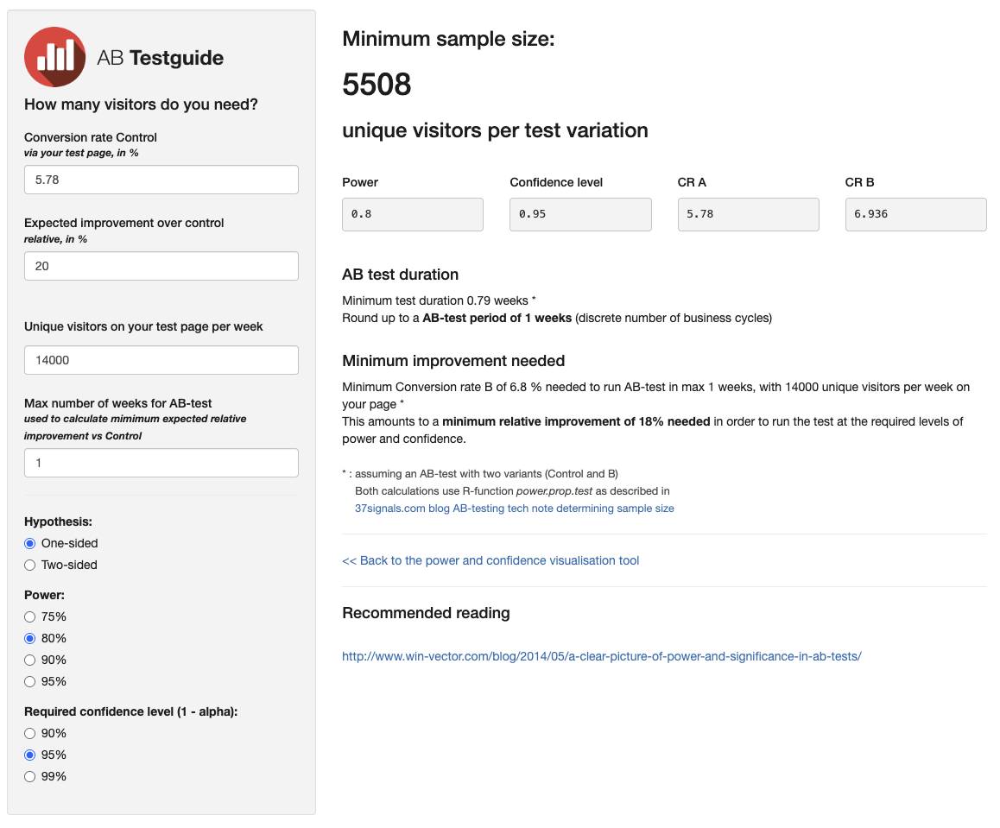
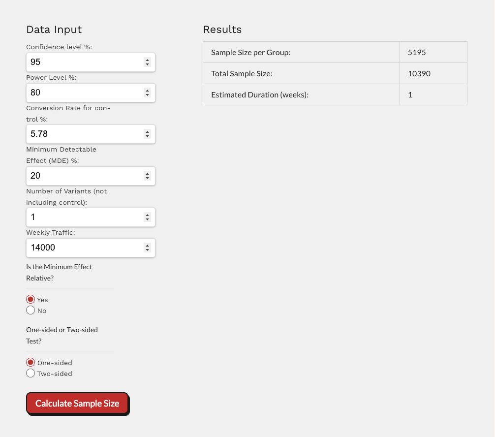
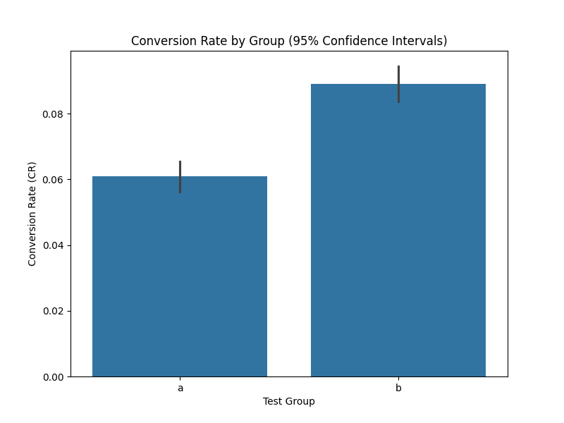
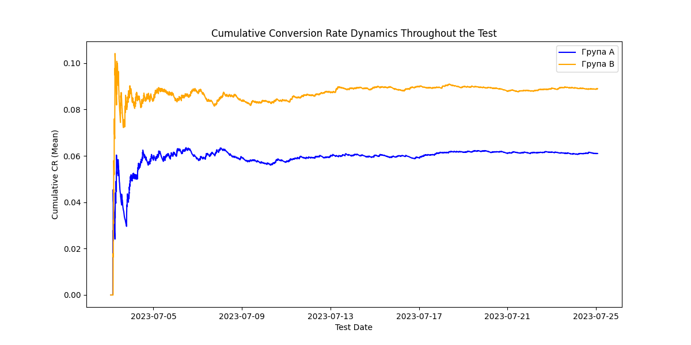

# conversion-rate-analysis-ab-test
A/B Test: Subscription CR Optimization. Achieved +46% conversion uplift (6.1% -> 8.9%) through psychological benefit framing . Python analysis (Z-test, Chi-squared) confirmed statistical significance (p=0.0) . Includes pre-test planning (MDE, power), sample calculation, reproducible code, and final results presentation

# 🧘 Yoga App · Subscription Screen CR Optimization

<div align="center">


</div>

---

## 📋 1. Project Overview

This project presents a **full-cycle A/B test analysis** aimed at optimizing the subscription screen of a Yoga mobile application.

**Primary Goal:** Increase the Install-to-Paid Conversion Rate (CR) by applying **psychological pricing tactics** — a discount label framing — without changing the actual product price.

<details>
<summary>🇺🇦 Читати українською</summary>

<br>

Цей проєкт — **повний цикл A/B тестування** для оптимізації екрана підписки мобільного застосунку для занять йогою.

**Основна мета:** Підвищити конверсію з установки в покупку (CR) за допомогою **психологічного фреймінгу ціни** — плашки «знижка» — без зміни реальної вартості продукту.

</details>

---

## 🔍 2. Context & Hypotheses

| Parameter | Details |
|-----------|---------|
| **Problem** | Users drop off at the payment screen without converting |
| **Group A — Control** | Standard screen with a **$4.99** price |
| **Group B — Variant** | Same **$4.99** price + **"-50% Discount"** label |
| **H₀ (Null)** | The discount label will NOT significantly affect conversion rate |
| **H₁ (Alternative)** | Psychological framing WILL increase conversion due to higher perceived value |

<details>
<summary>🇺🇦 Читати українською</summary>

<br>

| Параметр | Опис |
|----------|------|
| **Проблема** | Користувачі залишають екран оплати, не здійснюючи покупку |
| **Група A — Контроль** | Стандартний екран з ціною **$4.99** |
| **Група B — Варіант** | Та сама ціна **$4.99** + плашка **«Знижка 50%»** |
| **H₀ (Нульова)** | Плашка про знижку НЕ вплине на рівень конверсії |
| **H₁ (Альтернативна)** | Психологічний фреймінг ЗБІЛЬШИТЬ конверсію за рахунок іншого сприйняття вигоди |

</details>

---

## 🧮 3. Experiment Design & Sample Size Calculation

| Metric | Value |
|--------|-------|
| 🎯 **Target Metric** | Install-to-Paid Conversion Rate (CR) |
| 📊 **Baseline CR** | 5.78% |
| 📈 **MDE (Min. Detectable Effect)** | 20% |
| ⚖️ **Significance Level (α)** | 5% |
| 💪 **Statistical Power (1−β)** | 80% |
| 👥 **Required Sample Size** | **5,195 users per group** |
| 📅 **Test Duration** | 21 days |
| 🏆 **Prioritization Method** | RICE Model |

<details>
<summary>🇺🇦 Читати українською</summary>

<br>

| Метрика | Значення |
|---------|----------|
| 🎯 **Цільова метрика** | Conversion Rate (CR) з установки в оплату |
| 📊 **Базова конверсія** | 5.78% |
| 📈 **MDE (мінімальний помітний ефект)** | 20% |
| ⚖️ **Рівень значущості (α)** | 5% |
| 💪 **Статистична потужність (1−β)** | 80% |
| 👥 **Необхідний розмір вибірки** | **5 195 користувачів на групу** |
| 📅 **Тривалість тесту** | 21 день |
| 🏆 **Метод пріоритезації** | Модель RICE |

</details>

### 📸 Sample Size Calculator Screenshot

> *Screenshot of the sample size calculator used during experiment planning.*

<!-- Калькулятор выборки  -->



---

## 📊 4. Statistical Analysis (Python)

Analysis was performed in Python using **SciPy** and **Statsmodels** libraries.

### Data Summary

| Group | Users | CR |
|-------|-------|----|
| **A — Control** | 10,013 | **6.1%** |
| **B — Variant** | 9,985 | **8.9%** |
| **Total** | **19,998** | |

### Statistical Tests

| Test | Statistic | p-value | Result |
|------|-----------|---------|--------|
| **Z-test for Proportions** | — | **≈ 0.0** | ✅ Significant |
| **Chi-squared Test (χ²)** | **56.14** | **6.74e-14** | ✅ Significant |

**Conclusion:** Since p-value < 0.05, the **null hypothesis is rejected**. The difference is statistically significant.

<details>
<summary>🇺🇦 Читати українською</summary>

<br>

Аналіз проведено на Python з використанням бібліотек **SciPy** та **Statsmodels**.

### Зведення даних

| Група | Користувачі | CR |
|-------|-------------|----|
| **A — Контроль** | 10 013 | **6.1%** |
| **B — Варіант** | 9 985 | **8.9%** |
| **Разом** | **19 998** | |

### Статистичні тести

| Тест | Статистика | p-value | Результат |
|------|-----------|---------|-----------|
| **Z-тест для пропорцій** | — | **≈ 0.0** | ✅ Значущий |
| **Критерій Хі-квадрат (χ²)** | **56.14** | **6.74e-14** | ✅ Значущий |

**Висновок:** Оскільки p-value < 0.05, **нульова гіпотеза відхилена**. Різниця статистично значуща.

</details>

---

## 📈 5. Key Visuals

### 5.1 Conversion Rate Comparison — Bar Chart with 95% Confidence Intervals

> *The confidence intervals for Group A and B **do not overlap**, visually confirming statistical significance.*

<!-- Бар плот конверсии -->


<details>
<summary>🇺🇦 Читати українською</summary>

<br>

> *Стовпчаста діаграма показує, що довірчі інтервали груп А та B **не перетинаються**, що наочно підтверджує статистичну значущість результату.*

</details>

---

### 5.2 Cumulative CR Dynamics Over 21 Days

> *Variant B maintained a stable advantage throughout the entire test duration, confirming result reliability.*

<!-- Кумулятивный график -->


<details>
<summary>🇺🇦 Читати українською</summary>

<br>

> *Варіант B стабільно утримував перевагу протягом усіх 21 дня тесту, підтверджуючи надійність результату.*

</details>

---

## 💡 6. Business Decision & Next Steps

> 🏆 **+46% relative conversion uplift** achieved without increasing product costs.

| Metric | Value |
|--------|-------|
| Group A CR | 6.1% |
| Group B CR | 8.9% |
| **Relative Uplift** | **+46%** |
| **Decision** | ✅ Full rollout of Variant B to 100% of audience |

**Next Steps:**
- Test a **limited-time offer timer** to amplify urgency effect
- Add **Social Proof blocks** (reviews, user count) to the subscription screen
- Explore **annual plan framing** with a similar discount label

<details>
<summary>🇺🇦 Читати українською</summary>

<br>

> 🏆 **Відносний приріст конверсії +46%** без зміни вартості продукту.

| Метрика | Значення |
|---------|----------|
| CR групи A | 6.1% |
| CR групи B | 8.9% |
| **Відносний приріст** | **+46%** |
| **Рішення** | ✅ Повний Rollout Варіанту B на всю аудиторію |

**Наступні кроки:**
- Протестувати **таймер обмеженої пропозиції** для посилення ефекту терміновості
- Додати **блоки з відгуками (Social Proof)** на екран підписки
- Дослідити **фреймінг річного плану** з аналогічною плашкою знижки

</details>

---

## 🛠️ 7. Tech Stack

<div align="center">

| Tool | Purpose |
|------|---------|
| 🐍 **Python 3.x** | Data analysis & statistical testing |
| 📊 **Pandas** | Data manipulation |
| 📉 **SciPy / Statsmodels** | Z-test, Chi-squared test |
| 📈 **Matplotlib / Seaborn** | Visualizations |
| 📓 **Jupyter Notebook / Google Colab** | Analysis environment |

</div>

---

## 📁 Repository Structure

```
conversion-rate-analysis-ab-test/
│
├── 📊 Data/
│   └── ab_test_data.csv                     # Experiment dataset
│
├── 🖼️ images/
│   ├── conversion_rate.png                  # ← Bar chart with 95% CI
│   └── cumulative_conversion.png            # ← Cumulative CR over 21 days
│
├── 📓 notebooks/
│   └── ab_test_analysis.ipynb               # Main analysis notebook
│
├── 📁 planning/
│   ├── abtestguide_calculator.png           # ← Sample size calculator (abtestguide)
│   ├── cxl_calculator.png                   # ← Sample size calculator (CXL)
│   └── test_planning.pdf                    # Test planning document
│
├── 📑 presentation/
│   └── final_presentation.pdf               # Final presentation
```
---

## 👤 Author

<div align="center">

**Tetiana Bondarenko**  
Product Analyst

[](https://linkedin.com/in/bondarenkotetiana)
[](https://t.me/@Tashkabonda)

</div>

---

<div align="center">
Made with ❤️ for portfolio purposes
</div>
